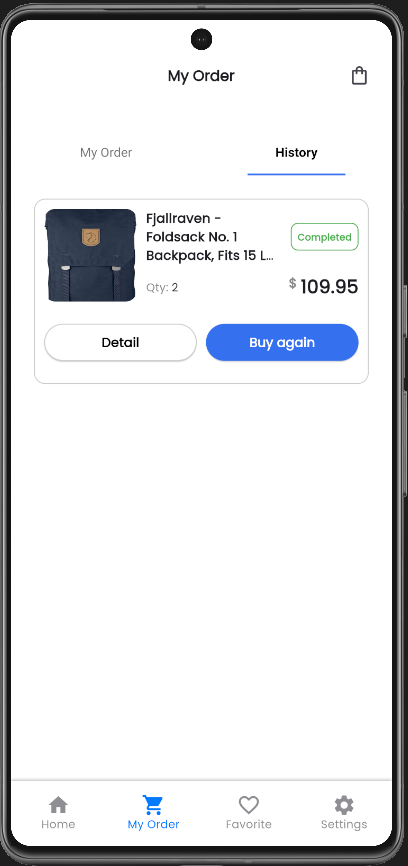

# ✨ E-commerce Final Project - Group 1 

projek ini adalah hasil dari kegiatan belajar di program MSIB Batch 6, Studi independen di MIKTI (Final Project). 

#
# 🧑‍💻 Group Member

- Sigit Suseno (Ketua Team)
- Halim Teguh Saputro (Wakil Ketua)
- Febry Christiani Thomas 
- Shasha Ramadhani Putri 
- Muhammad Iqbal Ramadhan Purba

#
# ❓ The Brief…

Era digitalisasi terus berkembang dan meluas membuat kebutuhan masyarakat atau konsumen juga semakin beragam. Perilaku konsumtif dari masyarakat yang ingin mudah dan instant juga menjadi hal yang perlu diperhatikan dalam perkembangan suatu bisnis. Hal tersebut membuat kebutuhan untuk memfasilitasi jual beli barang secara online semakin meningkat. Berbagai platform e-commerce yang tersedia di pasaran memerlukan sebuah aplikasi yang user-friendly dan komprehensif untuk menarik dan mempertahankan pengguna. Pada MSIB Batch 6 di MIKTI ini penulis diberikan project untuk menyelesaikan permasalahan tesebut.

Kutubu merupakan aplikasi e-commerce berbasis mobile yang menyediakan tempat untuk jual-beli berbagai jenis barang. Aplikasi ini membuka dan menyediakan berbagai jenis kategori kebutuhan yang bisa memenuhi kebutuhan pengguna (buyer). 

#
# 🧪 Packages / Libraries

In developing Kutubu application, we use several packages that are useful to improve the functionality and user experience. some of these packages are
among others:

- State Management (Provider & Getx)
- Persistent_bottom_nav_bar_v2
- Flutter_carousel_widget
- Flutter_native_splash
- FirebaseAuth
- Google_fonts
- image_picker
- Dio

#
# 🎴 Preview Application

## Splash Screen

## On Boarding Screen

## Login Screen

## Register Screen

## Home Screen

## Category Screen

## All Product Screen

## Filter Product

## Detail Product Screen

## Cart Screen

## Payment Screen

## Checkout Notification Screen

## Order Screen

## History Screen

## Favorite Screen

## Setting Screen

## Profile Screen

## Getting Started

This project is a starting point for a Flutter application.

A few resources to get you started if this is your first Flutter project:

- [Lab: Write your first Flutter app](https://docs.flutter.dev/get-started/codelab)
- [Cookbook: Useful Flutter samples](https://docs.flutter.dev/cookbook)

For help getting started with Flutter development, view the
[online documentation](https://docs.flutter.dev/), which offers tutorials,
samples, guidance on mobile development, and a full API reference.
